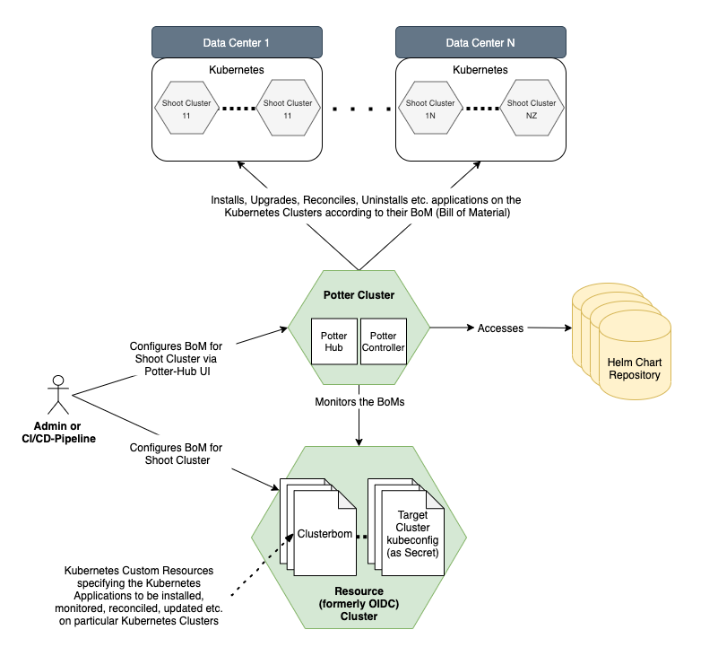

# Potter-Controller

## Overview

The following figure shows the complete setup of the Project Potter, including the components of [potter-controller](https://github.com/gardener/potter-controller) and [potter-hub](https://github.com/gardener/potter-hub). This guide describes only the installation of the potter-controller. For the potter-hub, please refer to the corresponding docs.



If you are installing this project into a [Gardener](https://gardener.cloud/) landscape, then the "resource" cluster will be the "garden" cluster from the Gardener landscape. The following guide mainly focuses on that scenario. In principle, it is also possible to store the ClusterBom in some other k8s cluster. Then also the access data to the target k8s clusters, on which the apps should be installed, must be stored in the same namespacs as the ClusterBoms for these target clusters. The access data must be stored as secrets containing the access data as a kubeconfig. The name of such a secret is used in the ClusterBom as the secretRef to the target cluster. 

## Installation Guide

**1. Clone the potter-controller repo and cd into the local repo directory**

```
git clone https://github.com/gardener/potter-controller
cd potter-controller
```

When you change values in the following steps, it is better to create a new .yaml file and only set the required values instead of overwriting the original values.yaml. Since the values.yaml file in the repository contains some placeholders that are only correctly set in the helm chart from the oci registry, the installation with the values.yaml from the repository may fail.

**2. Create the CRDs on the resource cluster**

Make sure you have set your kube context to point to the resource cluster, so that the following kubectl commands are performed within the context of the resource cluster. Select the namespace you want the controller to be installed in.
```
kubectl apply -f ./config/crd/bases
```

**3. Create the RBAC primitives on the resource cluster**

Again, for the following kubectl command, use the kube context of the resource cluster.
```
kubectl apply -f ./config/deployments/gardener-roles
```

This service account in `config/deployments/gardener-roles/clusterrole-clusterbom-controller.yaml` is used by the potter-controller to read the target cluster secrets (kubeconfigs) and the CRs (ClusterBoms) on the resource cluster. The cluster role defined in `config/deployments/gardener-roles/clusterrole-project-members.yaml` is used to extend the priveledges of Gardener project members to maintain ClusterBoms in their Garden project namespaces.   

If you plan to store the ClusterBoms in a k8s cluster which is not a Garden cluster, e.g. some Garden shoot cluster, you also need to deploy the secrets containing the access data in form of kubeconfigs to the target shoot clusters (on which you want to install the applications) to that cluster. The secret with the access data of a target shoot cluster must be stored in the same namespace as the ClusterBoms for that cluster. In that situation deploying `config/deployments/gardener-roles/clusterrole-project-members.yaml` is not needed but it is in the responsibility of the administrator to secure the access to the secrets and the ClusterBoms. 

**4. Create the kubeconfig for the service account**

you find a script in `chart/hub-controller/create-kubeconfig-for-serviceaccount.sh`. Open the script and exchange the variables `clusterURL` and `secretName` according to the RBAC primitives you created in Step 3. The `clusterURL` is the url to the kubernetes api server of this cluster, you can find this url in your kubeconfig.  The secret name refers to the automatically created secret for the service account, created earlier. To get the correct secret name, do a `kubectl get secrets` and earch for a secret that follows the naming: `app-hub-controller-token-<something>`. Use this name for the `secretName` field in the script.

Executing the script will generate a kubeconfig which uses the serviceaccount you just created and print it to the shell. This output must be set as a value in the potter-controller Helm Chart under the key `secretConfig.secretCluster`. On macOS, you can pipe the command output to `pbcopy` to copy it in the clipboard. Please ensure the indendation is correct:
```yaml
secretConfig:
  secretCluster: |
    apiVersion: v1
    kind: Config
#...
```

**5. Install an Ingress Controller in the Potter cluster**

The endpoints that are called by the webhooks (installed in the next step) are exposed via an Ingress. To work correctly, you must have an ingress controller installed in the Potter cluster, such as [ingress-nginx](https://github.com/kubernetes/ingress-nginx) or [traefik](https://github.com/traefik/traefik). If you choose ingress-nginx on a gardener shoot cluster, you can use the `Deployment >  Docker for Mac` installation step. Otherwise refer to the original projects for installation instructions.

Set ingress specific values in the values.yaml file. The host field follows `<abitrary>.<clusterdomain>`. You can get the cluster domain from the kubeconfig by removing the `api` subdomain from the API server URL.  

**6. Install the Webhooks on the resource cluster**

The potter-controller uses two admission webhooks. 

- The webhook configured in `./config/deployments/webhooks/clusterBomAdmissionHookConfig.yaml` checks and mutates Cluster-BoMs. You need to set the URL at `webhooks/clientConfig/url` to `https://<ingress domain of hub controller cluster>/checkClusterBom` with the correct ingress domain. The ingress domain has been configured in the previous step.  **This webhook is mandatory.** 

- The webhook configured in `./config/deployments/webhooks/secretAdmissionHookConfig.yaml` ensures that secrets created and maintained under the control of the hub controller are not changed by others. This webhook is not mandatory. You need to set the URL at `webhooks/clientConfig/url` to `https://<ingress domain of hub controller cluster>/checkSecret` with the correct ingress domain. The ingress domain has been configured in the previous step.

**By default, these webhooks are not secured.** If you want to secure them, you need to configure the API server of the resource cluster as described [here](https://kubernetes.io/docs/reference/access-authn-authz/extensible-admission-controllers/#authenticate-apiservers)
such that the requests to the webhook contain an authorization header with a JWT bearer token. Next, you need to enable the validation of these tokens by deploying the hub controller chart with the following additional values:

```
deploymentArgs:
  tokenReviewEnabled: true
  tokenIssuer: <issuer url>
```

Deploy the webhook configurations with the following command on the resource cluster:

```
kubectl apply -f ./config/deployments/webhooks
```

**7. Create the RBAC primitives on the Potter Cluster**

This service account is used for reading the apprepositories on the Potter cluster. By default it will be created in the `hub` namespace. You can change the namespace by modifying the yaml files. You have to create the namespace in advance.

```
kubectl apply -f ./config/deployments/hub-roles
```

**8. Create the kubeconfig for the service account**

First, change to the namespace from the previous step.
Then download the shell script [create-kubeconfig-for-serviceaccount.sh](./create-kubeconfig-for-serviceaccount.sh). Open the script and exchange the variables `clusterURL` and `secretName` according to the RBAC primitives you just created. The `clusterURL` is the url to the kubernetes api server of this cluster, you can find this url in your kubeconfig.  The secret name refers to the automatically created secret for the service account, created earlier. To get the correct secret name, do a `kubectl get secrets` and earch for a secret that follows the naming: `apprepository-reader-token-<something>`. Use this name for the `secretName` field in the script.

Executing the script will generate a kubeconfig which uses the serviceaccount you just created and print it to the shell. This output must be set as a value in the potter-controller Helm Chart under the key `secretConfig.apprepoCluster`. On macOS, you can pipe the command output to `pbcopy` to copy it in the clipboard. Please ensure the indendation is correct:
```yaml
secretConfig:
  apprepoCluster: |
    apiVersion: v1
    kind: Config
#...
```


**9. Install the potter-controller Helm Chart**

The following table includes all mandatory Chart parameters. For a list of ***all*** possible parameters, see the `Values.yaml`.
Before installing, **make sure to switch to the correct namespace you want the controller to be installed.**

Parameter | Description | Type | Required
--- | --- | --- | --- 
`secretConfig.apprepoCluster` | kubeconfig of the serviceaccount to read the apprepositories | string  | yes
`secretConfig.secretCluster` | kubeconfig of the service account to read the kubeconfig secrets and CRs | string | yes

The values-override.yaml file contains the values you modified in a seperate file, as described in step 1.

```
helm repo add potter <url>
helm install potter-controller potter/potter-controller -f values-override.yaml
```

**10. Configure Access to target cluster**
The potter-controller requires a secret with an encoded kubeconfig to access a target cluster. This secret has to be in the same namespace in which the clusterboms are be placed later on.
To create a secret with an encoded kubeconfig, switch to a namespace that should contain the clusterboms for this target cluster and execute: 
```
kubectl create secret generic  target.kubeconfig --from-file=kubeconfig=kubeconfig--target-cluster.yaml

```


**11. Create AppRepository CRs (optional)**

For using the `catalogAccess` in ClusterBoms, you must configure AppRepository CRs on your cluster. You can modify and apply the following to create a AppRepository (change the namespace according to your installation).

```
apiVersion: kubeapps.com/v1alpha1
kind: AppRepository
metadata:
  name: <repo-name>
  namespace: hub
spec:
  type: helm
  url: <repo-url>
```

For more information you can refer to the potter-hub Helm Chart.
